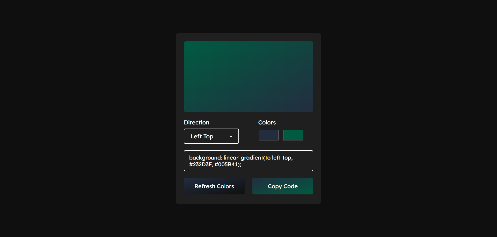

# Gradient Color Generator
THe Project a Simple Color Tools for make a Gradient in custom color and custom directions with a Generate Random Color nd Copy Gradient Code.

---

## Features
- Copy Code
- Generate Random Color
- CHange Direction Gradient
- Change Color Gradient Input

---

## Preview 📸

.

---

## How to use

Windows :

- Click index.html for your browsers in Explorer.

Linux :
- clone repository in terminal
```bash
git clone https://github.com/razercode-dev/gradient-color-generator.git
```

## Closing

That Project will a upgrade on next month or next year, so thank you for starred and like this repository.

Subscribe RazerCode for my video coding projects!

## Author
RazerCode

## License
This Project Use a MIT License.

